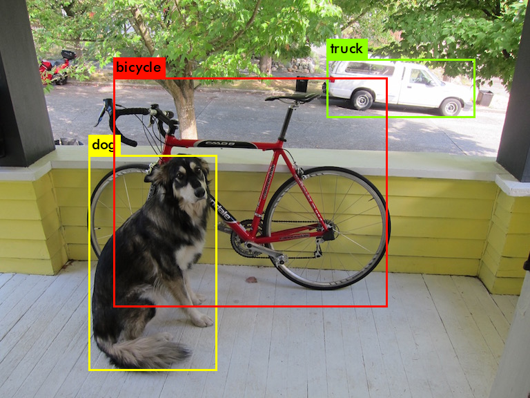
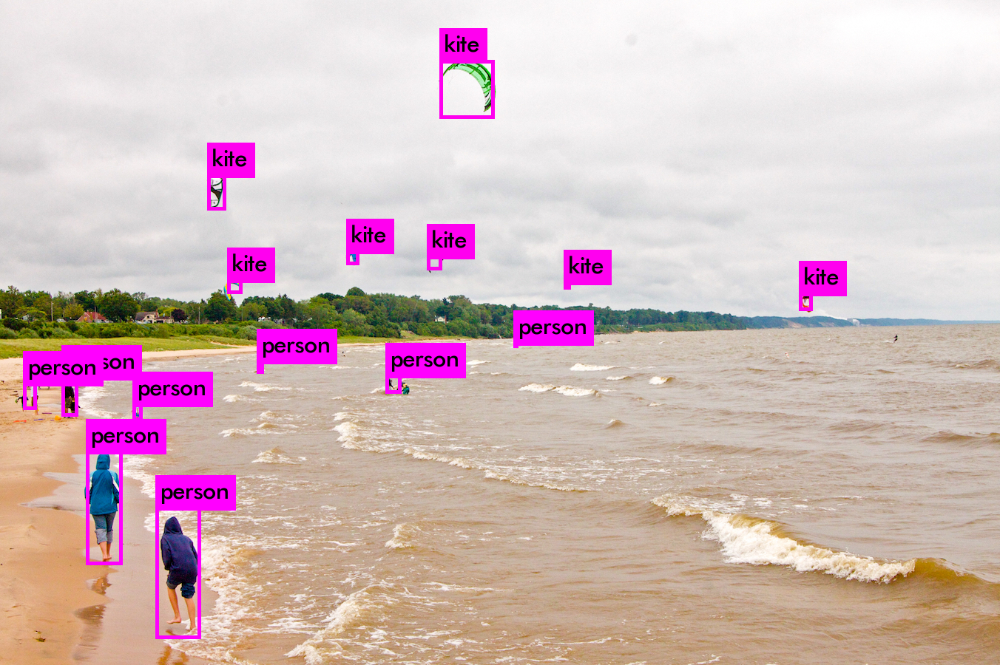
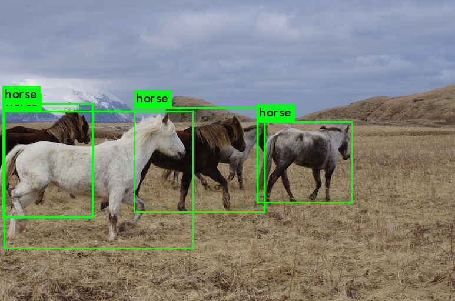
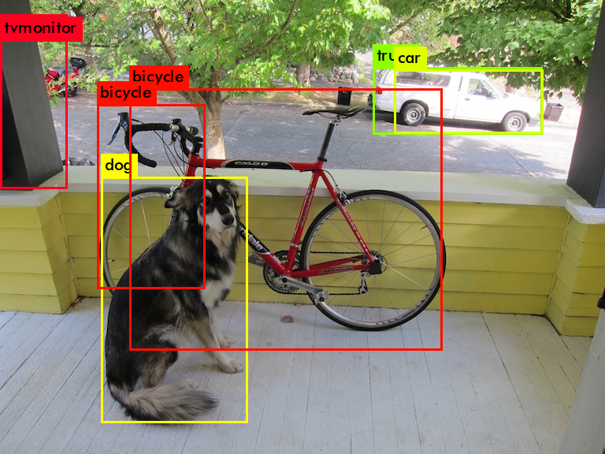

# Yolo v3

原始git项目请见 https://github.com/pjreddie/darknet

[yolo_v3算法详细介绍](https://pjreddie.com/media/files/papers/YOLOv3.pdf).

## 进入yolo_v3根目录编译

```
make
```

## 使用训练好的权重来检测

[网络权重下载](https://pjreddie.com/media/files/yolov3.weights)

### 单张图片的识别

加载网络权重，并对图片进行预测
```
./darknet detect cfg/yolov3.cfg ../yolov3.weights data/dog.jpg 
layer     filters    size              input                output
    0 conv     32  3 x 3 / 1   416 x 416 x   3   ->   416 x 416 x  32  0.299 BFLOPs
    1 conv     64  3 x 3 / 2   416 x 416 x  32   ->   208 x 208 x  64  1.595 BFLOPs
    2 conv     32  1 x 1 / 1   208 x 208 x  64   ->   208 x 208 x  32  0.177 BFLOPs
    3 conv     64  3 x 3 / 1   208 x 208 x  32   ->   208 x 208 x  64  1.595 BFLOPs
    4 res    1                 208 x 208 x  64   ->   208 x 208 x  64
......
  102 conv    256  3 x 3 / 1    52 x  52 x 128   ->    52 x  52 x 256  1.595 BFLOPs
  103 conv    128  1 x 1 / 1    52 x  52 x 256   ->    52 x  52 x 128  0.177 BFLOPs
  104 conv    256  3 x 3 / 1    52 x  52 x 128   ->    52 x  52 x 256  1.595 BFLOPs
  105 conv    255  1 x 1 / 1    52 x  52 x 256   ->    52 x  52 x 255  0.353 BFLOPs
  106 detection
Loading weights from ../yolov3.weights...Done!
data/dog.jpg: Predicted in 29.825535 seconds.
dog: 99%
truck: 92%
bicycle: 99%

```






### 多张图片的识别


```
./darknet detect cfg/yolov3.cfg ../yolov3.weights
layer     filters    size              input                output
    0 conv     32  3 x 3 / 1   416 x 416 x   3   ->   416 x 416 x  32  0.299 BFLOPs
    1 conv     64  3 x 3 / 2   416 x 416 x  32   ->   208 x 208 x  64  1.595 BFLOPs
    2 conv     32  1 x 1 / 1   208 x 208 x  64   ->   208 x 208 x  32  0.177 BFLOPs
......
  103 conv    128  1 x 1 / 1    52 x  52 x 256   ->    52 x  52 x 128  0.177 BFLOPs
  104 conv    256  3 x 3 / 1    52 x  52 x 128   ->    52 x  52 x 256  1.595 BFLOPs
  105 conv    255  1 x 1 / 1    52 x  52 x 256   ->    52 x  52 x 255  0.353 BFLOPs
  106 detection
Loading weights from ../yolov3.weights...Done!
Enter Image Path: data/horses.jpg                  
data/horses.jpg: Predicted in 23.668861 seconds.
horse: 98%
horse: 97%
horse: 92%
horse: 89%
Enter Image Path: 

```



### 增加阈值限制

```
./darknet detect cfg/yolov3.cfg ../yolov3.weights data/dog.jpg -thresh 0.1
layer     filters    size              input                output
    0 conv     32  3 x 3 / 1   416 x 416 x   3   ->   416 x 416 x  32  0.299 BFLOPs
    1 conv     64  3 x 3 / 2   416 x 416 x  32   ->   208 x 208 x  64  1.595 BFLOPs
    2 conv     32  1 x 1 / 1   208 x 208 x  64   ->   208 x 208 x  32  0.177 BFLOPs
    3 conv     64  3 x 3 / 1   208 x 208 x  32   ->   208 x 208 x  64  1.595 BFLOPs
......
  101 conv    128  1 x 1 / 1    52 x  52 x 256   ->    52 x  52 x 128  0.177 BFLOPs
  102 conv    256  3 x 3 / 1    52 x  52 x 128   ->    52 x  52 x 256  1.595 BFLOPs
  103 conv    128  1 x 1 / 1    52 x  52 x 256   ->    52 x  52 x 128  0.177 BFLOPs
  104 conv    256  3 x 3 / 1    52 x  52 x 128   ->    52 x  52 x 256  1.595 BFLOPs
  105 conv    255  1 x 1 / 1    52 x  52 x 256   ->    52 x  52 x 255  0.353 BFLOPs
  106 detection
Loading weights from ../yolov3.weights...Done!
data/dog.jpg: Predicted in 32.377885 seconds.
tvmonitor: 11%
dog: 99%
truck: 92%
car: 26%
bicycle: 99%
bicycle: 19%
```



```
./darknet detect cfg/yolov3.cfg ../yolov3.weights data/dog.jpg -thresh 0.5
layer     filters    size              input                output
    0 conv     32  3 x 3 / 1   416 x 416 x   3   ->   416 x 416 x  32  0.299 BFLOPs
    1 conv     64  3 x 3 / 2   416 x 416 x  32   ->   208 x 208 x  64  1.595 BFLOPs
    2 conv     32  1 x 1 / 1   208 x 208 x  64   ->   208 x 208 x  32  0.177 BFLOPs
    3 conv     64  3 x 3 / 1   208 x 208 x  32   ->   208 x 208 x  64  1.595 BFLOPs
    4 res    1                 208 x 208 x  64   ->   208 x 208 x  64
......
  102 conv    256  3 x 3 / 1    52 x  52 x 128   ->    52 x  52 x 256  1.595 BFLOPs
  103 conv    128  1 x 1 / 1    52 x  52 x 256   ->    52 x  52 x 128  0.177 BFLOPs
  104 conv    256  3 x 3 / 1    52 x  52 x 128   ->    52 x  52 x 256  1.595 BFLOPs
  105 conv    255  1 x 1 / 1    52 x  52 x 256   ->    52 x  52 x 255  0.353 BFLOPs
  106 detection
Loading weights from ../yolov3.weights...Done!
data/dog.jpg: Predicted in 29.811790 seconds.
dog: 99%
truck: 92%
bicycle: 99%
```


**由于没有NVIDIA显卡，所以这里没做实时识别**

## 训练网络

### VOC数据


